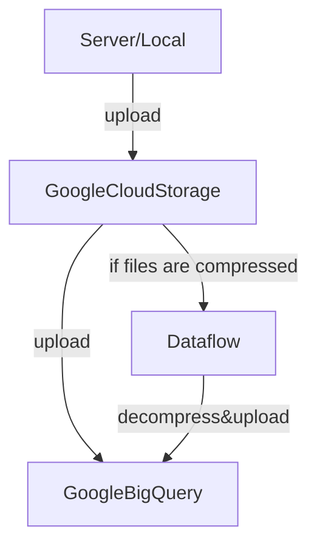

# Google BigQuery Setup: Uploading Data via Google Cloud Storage

Preparing to use BigQuery necessitates the uploading of data. There are various methods to [upload data into BigQuery](https://cloud.google.com/bigquery/docs/loading-data). For instance:

- Directly from the BigQuery interface (ideal for smaller datasets)
- From Google Drive

However, the aforementioned approaches may not be viable for large data uploads. A common practice for uploading large datasets involves using Google Cloud Storage (GCS).

> Overall process of uploading files
> 


Below, I briefly illustrate how to upload a dataset into GCS and prepare it for use with BigQuery.


## 1. Install gcloud CLI on server
To upload data from a server to GCS, the gcloud command line interface (CLI) needs to be installed on the server.

Install the gcloud CLI following the Linux section of [Install the gcloud CLI](https://cloud.google.com/sdk/docs/install#linux).

Note that installing gcloud CLI using apt-get, as described in the Debian/Ubuntu section, may result in a permission error.

Once installed, connect with your project by executing `gcloud init` in your terminal.

## 2. Uploading to Google Cloud Storage (GCS)
The gsutil `cp` command allows you to copy data between your local file system and the cloud, within the cloud, and between different cloud storage providers, like so:

```bash
gsutil cp file_or_folder_path gs://my-bucket
```

Next, file and folder uploading examples are briefly illustrated.

### File upload
To upload ```test.csv``` to the bucket ```gs://test_folder```, use:

```
gsutil cp test.csv gs://test_folder
```

You can also specify the name of the uploaded file as follows:

```
gsutil cp test.csv gs://test_folder/test_uploaded.csv
```

### Folder upload
To upload the folder ```test``` to the bucket ```gs://test_folder ```, use:


```
gsutil -m cp -r dir gs://my-bucket
```

Utilize the ```-r``` option to copy an entire directory tree. For transferring a large number of files, perform a parallel multi-threaded/multi-processing copy using the top-level gsutil ```-m``` option.


## 3. (if you upload compressed file,) unzip the file with Dataflow/Coogle Compute Engine(GCE)
When importing ```.gz``` files into BigQuery, be mindful that input files must be non-splittable and should not exceed 4GB. One solution is [Bulk Decompress Cloud Storage Files template](https://cloud.google.com/dataflow/docs/guides/templates/provided/bulk-decompress-cloud-storage#gcloud) with [Dataflow](https://cloud.google.com/dataflow?hl=en).
After successfully completed Bulk Decompress Cloud Storage Files, you can upload decompressed files from Cloud to BigQuery.

It is the simplest way to decompress the ```.gz``` files in GCS as far as I know. 

## 4. Import data from GCS to BigQuery
Follow big query UI. Select **create table from  Google Cloud Storage**, and import data.

*If you don't need the data in GCS after importing data into BigQuery, you can delete it to reduce the cost of storage.*


# Troubleshooting
## MAG case: import .txt file into BigQuery.
We need to specify the schema. You can define as json using the MAG_2021-12-06/bq_schemes/ info. Otherwise, you need to set columns and data types.

## Encoding problem
When I upload **mag/Papers.txt** and **mag/PaperAuthorAffiliations.txt** into BigQuery, I faced the issues of encoding because BigQuery supports UTF-8 encoding for both nested or repeated and flat data. 

Acutual errors was 

```
Failed to create table: Error while reading data, error message: Error detected while parsing row starting at position: 48237355519. Error: Bad character (ASCII 0) encountered 
```

You can solve this issue as follows.

1. before uploading the file from server to GCS, remove the  character (ASCII 0) by
	```
	perl -pe 's/\000/ /g' problem_file > converted_file
	```
	
2. Then, Upload to GCS and import into BigQuery as explained the above.
